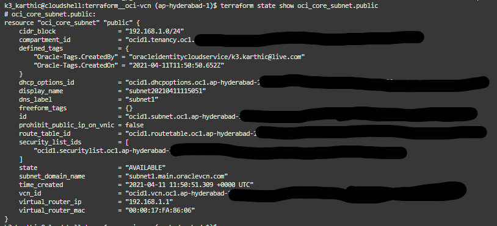
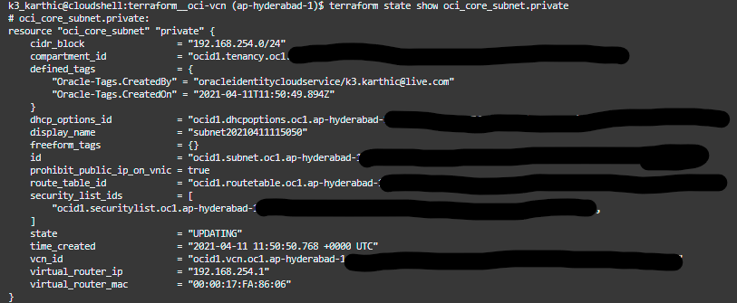

# Terraform — Create a Virtual Cloud Network in Oracle Cloud

Create a Virtual Cloud Network (VCN) in Oracle Cloud.

You can run two servers for free by using the [Oracle Cloud Always Free](https://www.oracle.com/cloud/free/#always-free) tier. Deploy an instance using either of the Terraform scripts below,
* terraform__oci-instance-1
    * GitHub: [github.com/k3karthic/terraform__oci-instance-1](https://github.com/k3karthic/terraform__oci-instance-1)
    * Codeberg: [codeberg.org/k3karthic/terraform__oci-instance-1](https://codeberg.org/k3karthic/terraform__oci-instance-1)
* terraform__oci-instance-2
    * GitHub: [github.com/k3karthic/terraform__oci-instance-2](https://github.com/k3karthic/terraform__oci-instance-2)
    * Codeberg: [codeberg.org/k3karthic/terraform__oci-instance-2](https://codeberg.org/k3karthic/terraform__oci-instance-2)
* terraform__oci-instance-3
    * GitHub: [github.com/k3karthic/terraform__oci-instance-3](https://github.com/k3karthic/terraform__oci-instance-3)
    * Codeberg: [codeberg.org/k3karthic/terraform__oci-instance-3](https://codeberg.org/k3karthic/terraform__oci-instance-3)

## Code Mirrors

* GitHub: [github.com/k3karthic/terraform__oci-vcn](https://github.com/k3karthic/terraform__oci-vcn/)
* Codeberg: [codeberg.org/k3karthic/terraform__oci-vcn](https://codeberg.org/k3karthic/terraform__oci-vcn)

## Configuration

**Step 1:** Create a file to store the [Terraform input variables](https://www.terraform.io/docs/language/values/variables.html). Use `india.tfvars.sample` as a reference. Keep `india.tfvars` as the filename or change the name in the following files,
1. `.gitignore`
1. `bin/plan.sh`

**Step 3:** Set `vcn_cidr`, `public1_cidr` and `private1_cidr` as desired.

**Step 3:** Set `compartment` to the desired value. List of compartments in your Oracle Cloud account are at [cloud.oracle.com/identity/compartments](https://cloud.oracle.com/identity/compartments).


## Authentication

[Oracle provider](https://registry.terraform.io/providers/hashicorp/oci/latest) documentation is at [registry.terraform.io/providers/hashicorp/oci/latest](https://registry.terraform.io/providers/hashicorp/oci/latest).

[Oracle Cloud Shell](https://www.oracle.com/devops/cloud-shell/) can deploy this script without configuration.

## Deployment

**Step 1:** Use the following command to create a [Terraform plan](https://www.terraform.io/docs/cli/run/index.html#planning),
```
$ ./bin/plan.sh
```

To avoid fetching the latest state of resources, use the following command,
```
$ ./bin/plan.sh -refresh=false
```

**Step 2:** Review the plan using the following command,
```
$ ./bin/view.sh
```

**Step 3:** [Apply](https://www.terraform.io/docs/cli/run/index.html#applying) the plan using the following command,
```
$ ./bin/apply.sh
```

**Step 4:** Use the following command to display the public subnet,
```
$ terraform show oci_core_subnet.public
```


**Step 5:** Use the following command to display the private subnet,
```
$ terraform show oci_core_subnet.private
```


## Encryption

Encrypt sensitive files (Terraform [input variables](https://www.terraform.io/docs/language/values/variables.html) and [state](https://www.terraform.io/docs/language/state/index.html)) before saving them. `.gitignore` must contain the unencrypted file paths.

Use the following command to decrypt the files after cloning the repository,
```
$ ./bin/decrypt.sh
```

Use the following command after running `bin/apply.sh` to encrypt the updated state files,
```
$ ./bin/encrypt.sh <gpg key id>
```
